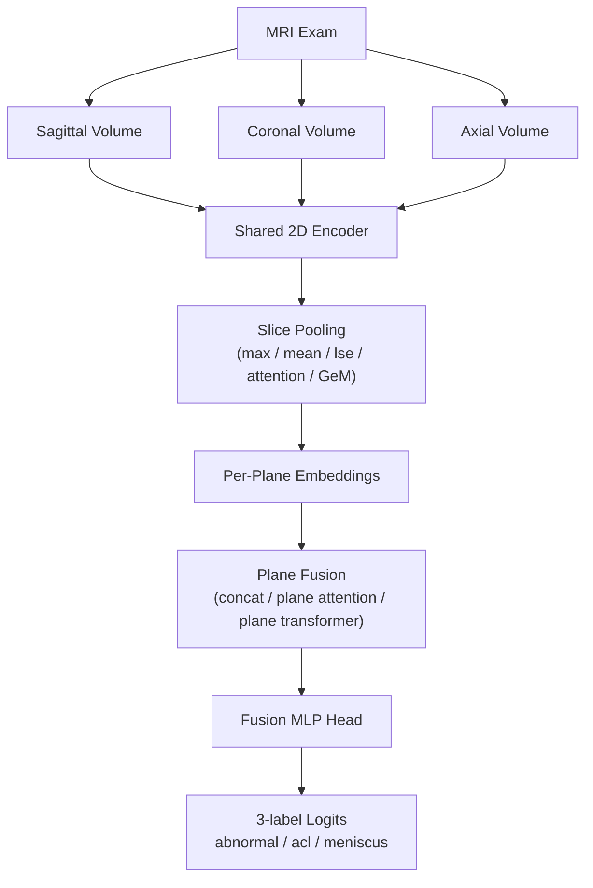
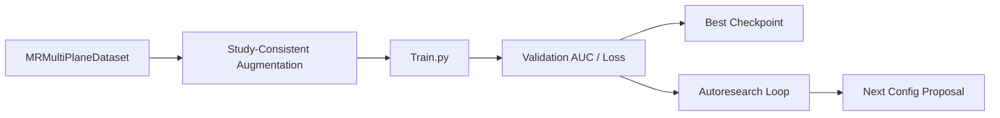

# MRNet Knee MRI Research Pipeline

Research-oriented training and autoresearch pipeline for multi-plane knee MRI classification on the [MRNet dataset](https://stanfordmlgroup.github.io/competitions/mrnet/).

This repository has been shaped for iterative model research on Apple Silicon and self-hosted GitHub Actions runners. It includes:

- multi-plane exam-level training
- lightweight shared encoders for fast experimentation
- cross-plane fusion variants
- self-supervised pretraining support
- MRI-specific augmentation policies
- a persistent autoresearch loop for architecture and hyperparameter exploration

## What This Project Does

The model predicts three labels from a full knee MRI exam:

- `abnormal`
- `acl`
- `meniscus`

Instead of training separate models per plane, the pipeline processes sagittal, coronal, and axial series together and fuses them into one exam-level prediction.

## Architecture

The current best-performing family in this repo is a lightweight multi-plane model built on `mobilenet_v3_small` with GeM pooling and learned cross-plane fusion.



### Training Pipeline



## Repository Layout

```text
.
├── README.md
├── LICENSE
├── train.py
├── dataloader.py
├── lightweight_models.py
├── pretrain_ssl.py
├── autoresearch_loop.py
├── research_controller.py
├── research_priors.py
├── export_ci_artifacts.py
├── cleanup_runner_diag.py
├── run_aug_research_sweep.sh
├── run_gt95_campaign.sh
├── run_gt95_architecture_locked.sh
└── requirements.txt
```

Generated data such as checkpoints, training logs, local datasets, and experiment outputs are intentionally excluded from Git.

## Requirements

- Python 3.10+
- PyTorch with MPS support if you are using Apple Silicon
- Local access to the MRNet dataset

## Dataset Setup

Request the dataset from Stanford:

- [MRNet dataset page](https://stanfordmlgroup.github.io/competitions/mrnet/)

Expected layout:

```text
MRNet-v1.0/
├── train-abnormal.csv
├── train-acl.csv
├── train-meniscus.csv
├── valid-abnormal.csv
├── valid-acl.csv
├── valid-meniscus.csv
├── train/
│   ├── axial/
│   ├── coronal/
│   └── sagittal/
└── valid/
    ├── axial/
    ├── coronal/
    └── sagittal/
```

The dataset is ignored by Git and should remain local.

## Installation

```bash
python -m venv .venv
source .venv/bin/activate
pip install -r requirements.txt
```

## Core Files

- `train.py`: main training entrypoint
- `dataloader.py`: exam-level dataset and augmentation logic
- `lightweight_models.py`: lightweight multi-plane architectures
- `pretrain_ssl.py`: self-supervised slice-level pretraining
- `autoresearch_loop.py`: persistent architecture / hyperparameter search
- `research_controller.py`: proposes next experiments based on history and priors

## Training

### Basic Example

```bash
python train.py \
  --prefix_name baseline_mobile \
  --model_type mobilenet_v3_small \
  --pretrained 1
```

### Strong Research-Fusion Style Example

```bash
python train.py \
  --prefix_name research_fusion_trial \
  --model_type mobilenet_v3_small \
  --pretrained 1 \
  --pooling gem \
  --plane_fusion plane_attention \
  --fusion_depth 3 \
  --projection_dim 128 \
  --hidden_dim 192 \
  --dropout 0.15 \
  --lr 0.00008 \
  --weight_decay 0.0005 \
  --aug_policy knee_mri_plus \
  --loss_type focal \
  --focal_gamma 1.5 \
  --label_smoothing 0.03 \
  --ema_decay 0.995
```

### Useful Flags

| Flag | Purpose |
| --- | --- |
| `--model_type` | Backbone family |
| `--pretrained` | Toggle ImageNet initialization |
| `--pooling` | Slice aggregation |
| `--plane_fusion` | Cross-plane fusion strategy |
| `--fusion_depth` | Depth of fusion MLP |
| `--projection_dim` | Per-plane projection size |
| `--hidden_dim` | Fusion hidden width |
| `--aug_policy` | Augmentation recipe |
| `--loss_type` | `bce` or `focal` |
| `--ema_decay` | Exponential moving average for evaluation |
| `--val_tta_mode` | Validation-time test-time augmentation |

## MRI-Specific Augmentation

The repo includes several augmentation modes:

- `none`
- `light`
- `strong`
- `knee_mri`
- `knee_mri_plus`
- `knee_mri_research`

### `knee_mri_research`

This is the newest MRI-focused policy. It was designed to keep anatomy plausible while improving robustness to scanner and acquisition variation.

It adds:

- study-consistent augmentation across all three planes
- mild gamma and intensity jitter
- controlled cutout and slice dropout
- mild spatial shifts
- bias-field intensity drift
- blur / resolution perturbation
- low-probability motion-style artifact simulation

Associated knobs:

- `--aug_bias_field_std`
- `--aug_blur_sigma`
- `--aug_motion_prob`
- `--aug_noise_std`
- `--aug_cutout_frac`
- `--aug_slice_dropout`
- `--aug_gamma_jitter`
- `--aug_spatial_shift_frac`

## Self-Supervised Pretraining

You can pretrain the encoder on MRNet slices before supervised fine-tuning.

```bash
python pretrain_ssl.py \
  --prefix_name ssl_mobile_trial \
  --model_type mobilenet_v3_small \
  --pretrained 1 \
  --data_root MRNet-v1.0
```

Then fine-tune:

```bash
python train.py \
  --prefix_name ssl_finetune_trial \
  --model_type mobilenet_v3_small \
  --pretrained 1 \
  --pooling gem \
  --plane_fusion plane_transformer \
  --aug_policy knee_mri_plus \
  --loss_type focal \
  --ema_decay 0.995 \
  --init_checkpoint ssl_pretrain_outputs/ssl_mobile_trial_best_ssl.pth
```

## Autoresearch Loop

The repo includes a persistent autoresearch loop that:

- tracks the current best configuration
- proposes new experiments from priors and recent results
- keeps only the best checkpoint
- records result history and research memos

Basic usage:

```bash
python autoresearch_loop.py \
  --iterations 12 \
  --data_root MRNet-v1.0
```

Artifacts are stored under a persistent state directory, including:

- `best_config.json`
- `results.tsv`
- `research_memos/`
- `models/best_model.pth`

## GitHub Actions

The top-level repository includes a self-hosted GitHub Actions workflow for autoresearch.

Recommended setup:

1. Register an Apple Silicon self-hosted runner
2. Set repository variable `MRNET_DATA_ROOT`
3. Trigger the workflow manually or via schedule

The workflow is intended to upload lightweight experiment summaries and logs, not datasets or model weights.

## Reproducibility Notes

- Validation AUC is the primary model-selection metric
- Full-training results can differ from short-loop results
- Aggressive augmentation and TTA do not automatically improve the best full-training result
- The most reliable way to compare ideas is to keep architecture fixed and vary one factor at a time

## What Is Not Stored In Git

This repository is configured not to push:

- local datasets
- model weights and checkpoints
- generated training logs
- full training output directories
- runner/export artifacts

See `.gitignore` for the enforced exclusions.

## License

See `LICENSE`.
